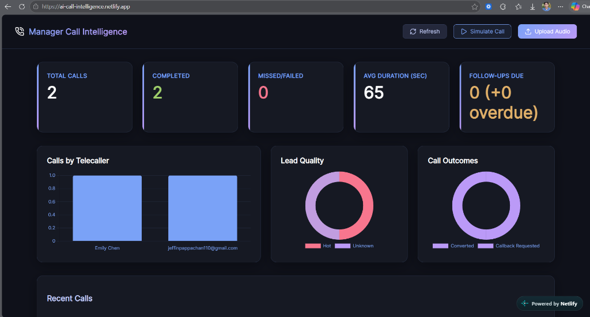
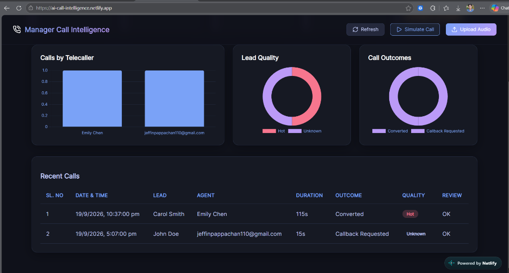
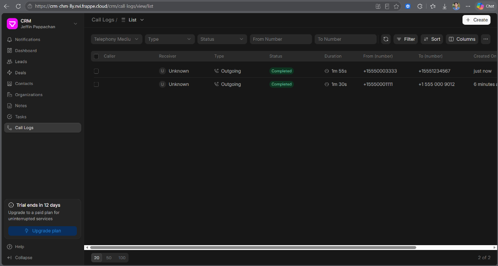
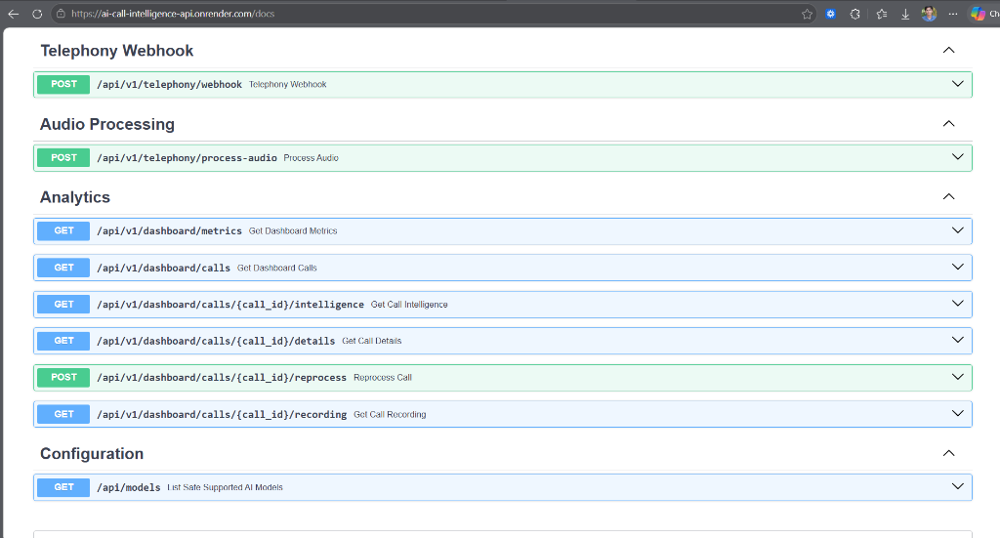

# AI Call Intelligence with Frappe CRM

> **Assessment Track:** Test Work 01 — Hash Adz Creative Consultant AI Automation Developer Technical Test  
> **Version:** 3.0 (Updated September 2026)  
> **Target CRM:** Frappe Cloud CRM (`https://crm-chm-lly.nvi.frappe.cloud`)  
> **Backend:** Python 3.13, FastAPI, Pydantic v2, HTTPX, Pytest, Groq (Whisper + LLaMA)  
> **Frontend:** React 18, Vite, Lucide Icons, Vanilla CSS  
> **Cloud Deployments:** Netlify (Frontend), Render (Backend API), Supabase (PostgreSQL & Audio Storage)  

---

## 1. Project Purpose

This system implements an end-to-end, production-grade telecaller intelligence pipeline that bridges telephony audio/webhooks with Frappe CRM:
1. **Call Ingestion:** Ingests completed telephony call events (Exotel / Twilio format) or direct audio recording uploads (MP3, WAV, M4A).
2. **Speech-to-Text (STT):** High-speed transcription using **Groq Whisper** (`whisper-large-v3`) with multilingual support (English, Malayalam, etc.).
3. **Structured AI Intelligence:** Real-time business intelligence extraction using **Groq LLM** (`openai/gpt-oss-20b`) with strict Pydantic schema validation:
   - Call Summary & Customer Intent
   - Categorized Call Outcome (`Converted`, `Follow-up`, `Interested`, `Not Interested`, `Callback Requested`, etc.)
   - Assessed Lead Quality (`Hot`, `Warm`, `Cold`)
   - Primary Objections & Discussion Key Points
   - Next Operational Action & Recommended Follow-up Dates
   - Telecaller Quality Observations & Manager Review Flags
4. **CRM Synchronization:** Bi-directional integration with Frappe Cloud CRM:
   - Look up existing Leads by caller/callee phone number.
   - Create live `CRM Call Log` linked to the Lead.
   - Attach formatted AI Intelligence summaries as timeline Comments.
   - Auto-schedule follow-up `CRM Task` assigned to the telecaller with validated deadlines.
   - Update CRM Lead stage and quality rating.
5. **Manager Intelligence Dashboard:** Premium, responsive React frontend with analytics charts, audio playback streaming, full transcripts, and on-demand AI re-analysis.

---

## 2. Live System Screenshots

### Executive Manager Dashboard (Real-time Analytics & KPIs)
> Real-time executive dashboard hosted on Netlify, displaying call volume, completion rates, average call durations, telecaller activity breakdown, and outcome distribution.


### Recent Calls Intelligence Feed
> Live call intelligence feed with customer lead identification, telecaller attribution, duration, AI call outcome categorizations, lead quality tags (`Hot`, `Warm`, `Cold`), and review flags.


### Frappe Cloud CRM Live Synchronization
> Automatic bi-directional synchronization showing completed `CRM Call Log` documents created directly in Frappe Cloud CRM with telephony metadata, timestamps, and caller/callee numbers.


### Production Interactive API Documentation (FastAPI Swagger UI)
> Production REST API documentation deployed on Render exposing telephony webhook receivers, audio processing pipeline, dashboard analytics, and on-demand AI re-analysis endpoints.


---

## 3. Architecture & Pipeline Flow

```
┌──────────────────────────────────────────────────────────────────┐
│                      Call Ingestion Sources                      │
│   • Telephony Webhooks (Exotel / Twilio / Custom)                │
│   • Direct Audio Recording Uploads (Vite React Web Dashboard)    │
└─────────────────────────────────┬────────────────────────────────┘
                                  │
                                  ▼
┌──────────────────────────────────────────────────────────────────┐
│                 FastAPI Webhook & Processing API                 │
│   • Strict Request-ID & Correlation Tracking (`X-Request-ID`)    │
│   • Idempotency & Concurrency Guard (Memory / SQLite / Supabase) │
│   • MIME & Payload Validation (25MB audio streaming limit)       │
└──────────────────┬───────────────────────────────┬───────────────┘
                   │                               │
                   ▼                               ▼
    ┌──────────────────────────────┐ ┌──────────────────────────────┐
    │     Audio Storage Layer      │ │      Speech-to-Text Layer    │
    │  • Local Filesystem /        │ │  • Groq Whisper              │
    │  • Supabase Storage Bucket   │ │    (`whisper-large-v3`)      │
    └──────────────────────────────┘ └─────────────┬────────────────┘
                                                   │ Transcript
                                                   ▼
┌──────────────────────────────────────────────────────────────────┐
│                   Structured LLM Analysis Layer                  │
│   • Groq LLaMA / GPT (`openai/gpt-oss-20b`)                      │
│   • Strict Pydantic Schema Parsing with Enum Normalization       │
│   • Auto-Healing of Mock Data to Real Intelligence               │
└──────────────────────────────────┬───────────────────────────────┘
                                   │
                                   ▼
┌──────────────────────────────────────────────────────────────────┐
│                   Frappe Cloud CRM Integration                   │
│   ├── Lookup Lead by Phone Number (`CRM Lead`)                   │
│   ├── Create CRM Call Log with Audio & Telecaller Attribution    │
│   ├── Post AI Intelligence Timeline Comment                      │
│   ├── Auto-schedule Follow-up CRM Task (`CRM Task`)              │
│   └── Update Lead Stage & Quality Rating                         │
└──────────────────────────────────┬───────────────────────────────┘
                                   │
                                   ▼
┌──────────────────────────────────────────────────────────────────┐
│                     Executive Manager Dashboard                  │
│   • KPI Cards: Total Calls, Follow-ups, Review Flags, Quality   │
│   • Visual Charts: Outcomes Breakdown, Telecaller Activity       │
│   • Call Intelligence Details Modal:                             │
│       - Direct Byte Audio Player (Scrub/Seek with Range headers) │
│       - Speech-to-Text Transcript Display                        │
│       - Structured AI Summary, Intent, Key Points, Next Actions  │
│       - On-Demand "Re-analyze Audio" Button                      │
└──────────────────────────────────────────────────────────────────┘
```

For complete Mermaid system and sequence diagrams, see [docs/architecture.md](docs/architecture.md).

---

## 4. Project Structure

```
e:\Hash
├── frontend/                       # Vite + React Executive Dashboard
│   ├── src/
│   │   ├── components/
│   │   │   ├── Dashboard.jsx       # Main Dashboard container with auto-refresh
│   │   │   ├── Header.jsx          # Top navigation, live refresh & upload trigger
│   │   │   ├── KPICards.jsx        # Summary KPI cards (Total, Follow-ups, etc.)
│   │   │   ├── ChartsGrid.jsx      # Chart.js visual analytics (Outcomes, Agents)
│   │   │   ├── CallsTable.jsx      # Recent calls table with search & filters
│   │   │   ├── CallDetailsModal.jsx# Details modal with audio player & AI re-analysis
│   │   │   └── UploadModal.jsx     # Recording upload modal with CRM contact picker
│   │   ├── App.jsx
│   │   └── index.css               # Design system & dark mode styles
│   ├── package.json
│   └── vite.config.js              # Vite bundler configuration with dev proxy
├── docs/
│   ├── screenshots/                # Application UI screenshots
│   ├── environment-inspection.md   # System inspection & tool verification
│   └── architecture.md             # Mermaid architecture diagrams
├── samples/
│   ├── mock_webhook_payload.json   # Sample Exotel-format outbound call payload
│   └── mock_webhook_malayalam.json # Sample Malayalam call payload
├── src/
│   ├── __init__.py
│   ├── config.py                   # Pydantic Settings & environment loader
│   ├── schemas.py                  # Pydantic schemas (CallIntelligence, PipelineResponse)
│   ├── stt_service.py              # STT abstraction (Groq Whisper + MockSTT)
│   ├── ai_service.py               # AI extraction abstraction (Groq LLM + MockAI)
│   ├── frappe_client.py            # Frappe CRM HTTPX client with Token Auth & retry
│   ├── pipeline.py                 # Core orchestration, background worker & idempotency
│   ├── server.py                   # FastAPI REST API & dashboard backend
│   ├── supabase_store.py           # Supabase PostgreSQL persistence & Storage integration
│   ├── observability.py            # Structured JSON logging, metrics & correlation IDs
│   └── worker.py                   # In-process asynchronous task worker
├── tests/
│   ├── __init__.py
│   ├── test_schemas.py             # Schema & field validation tests
│   ├── test_ai_stt.py              # STT and AI service unit tests
│   ├── test_audio_intelligence.py  # Audio processing & STT/AI pipeline tests
│   ├── test_idempotency.py         # Webhook deduplication tests
│   ├── test_api.py                 # FastAPI endpoint integration tests
│   ├── test_analytics.py           # Analytics & metrics calculation tests
│   ├── test_phase5_1_concurrency.py# Concurrency & worker claiming tests
│   ├── test_phase5_2_reliability.py# Reliability, retry & failure tests
│   ├── test_phase5_3_observability.py# Metrics, health & logging tests
│   └── test_phase5_hardening.py    # Production security & hardening tests
├── Dockerfile                      # Production container image definition
├── docker-compose.yml              # Multi-container orchestration
├── requirements.txt                # Python dependencies
└── README.md                       # Comprehensive documentation
```

---

## 5. Environment Setup

### Prerequisites
- Python 3.11+ (Python 3.13 supported)
- Node.js 18+ and npm
- Git

### 1. Backend Setup

```powershell
# In project root (e:\Hash)
python -m venv .venv
.\.venv\Scripts\Activate.ps1

# Install Python dependencies
pip install -r requirements.txt
```

### 2. Frontend Setup

```powershell
cd frontend
npm install
```

### 3. Environment Configuration

Copy `.env.example` to `.env` in the root directory:

```env
# Application Settings
APP_ENV=development
MOCK_MODE=false
HOST=0.0.0.0
PORT=8000

# Frappe Cloud CRM Configuration
FRAPPE_BASE_URL=https://crm-chm-lly.nvi.frappe.cloud
FRAPPE_API_KEY=your_frappe_api_key
FRAPPE_API_SECRET=your_frappe_api_secret

# AI & Speech-to-Text (Groq)
AI_PROVIDER=groq
AI_API_KEY=gsk_your_groq_api_key
STT_PROVIDER=groq
STT_API_KEY=gsk_your_groq_api_key

# Supabase (Optional for Cloud Persistence)
SUPABASE_URL=https://your-project.supabase.co
SUPABASE_SERVICE_KEY=your-supabase-service-key
IDEMPOTENCY_BACKEND=supabase
```

---

## 6. Running Locally

### Start Backend API Server
```powershell
.\.venv\Scripts\python.exe -m uvicorn src.server:app --reload --host 0.0.0.0 --port 8000
```
- Interactive Swagger UI: [http://localhost:8000/docs](http://localhost:8000/docs)
- Health Check: [http://localhost:8000/health](http://localhost:8000/health)

### Start Frontend Development Server
```powershell
cd frontend
npm run dev
```
- Access Frontend Dashboard: [http://localhost:5173](http://localhost:5173)

---

## 7. Core REST API Endpoints

| Method | Endpoint | Description |
| :--- | :--- | :--- |
| `POST` | `/api/v1/telephony/webhook` | Ingests telephony call event webhooks with idempotency guard. |
| `POST` | `/api/v1/telephony/process-audio` | Uploads audio recording (`.mp3`, `.wav`, `.m4a`) with CRM metadata. |
| `GET` | `/api/v1/dashboard/metrics` | Returns aggregated KPIs, outcome breakdown, and lead quality metrics. |
| `GET` | `/api/v1/dashboard/calls` | Returns recent call feed with automatic background auto-healing. |
| `GET` | `/api/v1/dashboard/calls/{call_id}/details` | Full call record, transcript, audio path, and AI intelligence. |
| `GET` | `/api/v1/dashboard/calls/{call_id}/intelligence` | Structured AI intelligence extracted for a call. |
| `GET` | `/api/v1/dashboard/calls/{call_id}/recording` | Direct byte streaming of audio recording with range/seek headers. |
| `POST` | `/api/v1/dashboard/calls/{call_id}/reprocess` | Forces re-transcription and AI re-analysis on recorded audio. |
| `GET` | `/api/v1/crm/contacts` | Fetches active CRM Contacts/Leads for upload selection. |
| `GET` | `/api/v1/crm/agents` | Fetches registered CRM telecallers/users. |
| `GET` | `/health` | Application liveness probe returning provider configurations. |
| `GET` | `/ready` | Application readiness probe validating backend dependencies. |
| `GET` | `/metrics` | Prometheus/JSON telemetry metrics. |

---

## 8. Running the Automated Test Suite

The project includes an extensive test suite covering schema validation, STT/AI abstractions, idempotency, CRM integration, concurrency, and reliability:

```powershell
# Run all 67 offline unit tests
.\.venv\Scripts\python.exe -m pytest --ignore=tests/test_live_frappe.py -v
```

### Test Coverage Highlights:
- **`test_schemas.py`**: Pydantic schema validation, phone number formatting, and enum constraints.
- **`test_ai_stt.py` & `test_audio_intelligence.py`**: STT transcription, LLM extraction, empty file checks, and 25MB streaming limit.
- **`test_idempotency.py`**: Deduplication of duplicate webhook events across TTL windows.
- **`test_phase5_1_concurrency.py`**: Worker concurrency protection and job claiming.
- **`test_phase5_2_reliability.py`**: Retry mechanisms, exponential backoff, and partial failure isolation.
- **`test_phase5_3_observability.py`**: Metric counters, correlation IDs, and health checks.
- **`test_api.py`**: FastAPI HTTP endpoints, CORS headers, and error responses.

---

## 9. Deployment Architecture

### Frontend (Netlify)
- **Live URL:** [https://ai-call-intelligence.netlify.app](https://ai-call-intelligence.netlify.app)
- Automatically deploys from `main` branch with build command `npm run build` in `frontend/`.
- Configured with `VITE_API_BASE_URL` pointing to the live Railway backend.

### Backend (Railway)
- **Live API:** `https://frappe-call-intelligence-production.up.railway.app`
- Dockerized deployment built directly from [Dockerfile](Dockerfile).
- Automatic port binding via dynamic `$PORT`.
- Environment variables configured in Railway Dashboard:
  - `MOCK_MODE=false`
  - `AI_PROVIDER=groq`
  - `STT_PROVIDER=groq`
  - `AI_API_KEY=gsk_...`
  - `STT_API_KEY=gsk_...`
  - `FRAPPE_BASE_URL=https://crm-chm-lly.nvi.frappe.cloud`
  - `FRAPPE_API_KEY=...`
  - `FRAPPE_API_SECRET=...`
  - `IDEMPOTENCY_BACKEND=supabase`
  - `SUPABASE_URL=https://lwxwnitinlddzfyegyyd.supabase.co`
  - `SUPABASE_SERVICE_KEY=...`

---

## 10. Key Technical Features & Safeguards

1. **Direct Audio Streaming:** The `/recording` endpoint serves audio bytes directly with `Accept-Ranges: bytes` headers, avoiding CORS issues with third-party presigned redirects and enabling continuous audio scrubbing.
2. **Auto-Healing Intelligence:** Calls loaded in the dashboard automatically detect mock placeholder data and re-transcribe/re-analyze using real Groq Whisper and LLM models.
3. **Resilient CRM Call Log Creation:** If an agent name is not a registered user in Frappe CRM, the client automatically falls back to create the call log without link validation errors, ensuring zero data loss.
4. **Duplicate Prevention:** Incoming telephony webhooks are deduplicated via unique provider call IDs, preventing duplicate CRM Call Logs or duplicate tasks.
5. **Observability:** Every request carries an `X-Request-ID` correlation tag traced across application logs and API error responses.

