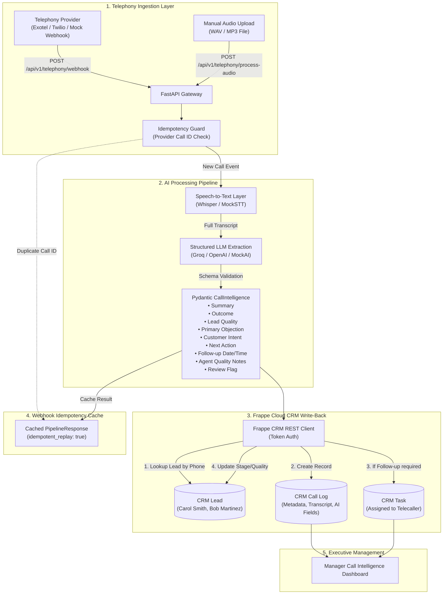

# System Architecture — AI Call Intelligence with Frappe CRM

## Overview

The AI Call Intelligence system bridges telephony call events and recordings with Frappe CRM. It ingests call events, executes speech-to-text transcription, runs structured business intelligence extraction with strict Pydantic validation, and updates Frappe CRM records (Call Logs, Leads, and Follow-up Tasks).

---

## Mermaid Architecture Diagram

---

## Component Separation & Boundaries

1. **FastAPI Webhook Gateway (`src/server.py`):**
   - Non-blocking entry points for external telephony providers.
   - Idempotency check prevents duplicate Call Log creation on webhook replays.

2. **AI & Speech Providers (`src/stt_service.py`, `src/ai_service.py`):**
   - Pluggable abstract interfaces (`STTService`, `AIService`).
   - Offline `MockSTTService` and `MockAIService` allow instant local testing without external API dependencies.
   - Real implementations (Groq Whisper, OpenAI GPT, or Google Gemini) plug seamlessly into the same interface.

3. **Validation Layer (`src/schemas.py`):**
   - Enforces the 9 assessment-mandated structured business fields via Pydantic v2.
   - Guarantees valid enums and parsed ISO timestamps for follow-up scheduling.

4. **Frappe CRM REST Client (`src/frappe_client.py`):**
   - Communicates with Frappe Cloud (`https://crm-chm-lly.nvi.frappe.cloud`) using HTTP token authentication.
   - Automatically handles Lead phone number normalization, Call Log creation, Follow-up Task assignment, and Lead stage updates.
